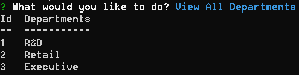
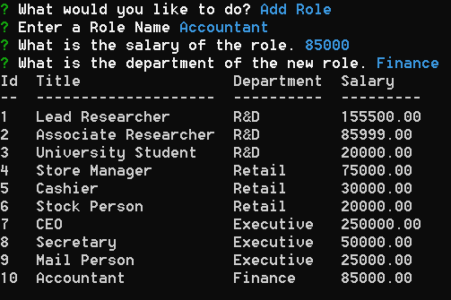

# Employee Database

## **The mySQL based Employee Database**
This program allows you to keep track of your employees in your business using an SQL database. Using MySQL to organize the database, we can access informationa about or organization and its employees.

- When the user navigates to the root folder, they simply type 'npm start' to initialize the database. On initialization they are presented with a series of options to view and manipulate the data in the database.

- They can view all employees

- All Roles 

- All Departments

- Or a by a specific criteria where we can view employees by department, role or manager.

- You can also add new departments, such as the finance department

- You can also add new roles to any department

- You can add an employee to any role or department, such as Charlie Brown in the finance department as our new accountant. Currently he has no one working under him

- We can also edit the employees role, we have changed Charlie's job to an associate researcher

- Now that Charlie is an associate researcher, we need to change his manager. he now works under Gayle Aarens

- You can also default to the original database by selecting the 'load default database' selection 

- Finally, you can exit the program safely and return to the command console.

# Why it Matters?
Learning and using SQL is an efficient way to store, sort, filter and manipulate large quantities of data and present them in a efficient manner in a program or for yourself. CRUD or Create, Read, Update and Delete are the basic functions of persistent storage. Learning SQL and using it is vital for creating programs that utilize CRUD for a better user experience for those using the application, and the developer maintaining large amounts of data. 

Watch my employee database in action! 

The employee database in 2 minutes: [Click here!](https://youtu.be/E1kB1utLUyw)

A detailed overview: [Click Here!](https://www.youtube.com/watch?v=vpxfj77bQ-8)

## 
We Hope to see you there!
 ##
